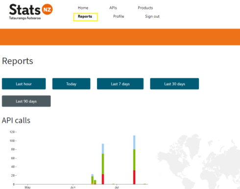

---

View the [Wiki](https://github.com/StatisticsNZ/open-data-api/wiki) to understand how to use the Open Data service

---

# Accessing Stats NZ Open data

## The open data developer account

Sign up to be an open data developer at https://api.stats.govt.nz.

If you already have a Business to Consumer account with us, you can login right away.  Otherwise, you can either create an account using your own Google social account or create a Stats NZ account.

## Sign up/ sign

Sign up or Sign in with using a preferred account method as below

## Select a service Product

To access the Stats NZ Open Data service, you’ll need to subscribe to one or more of the products offered by the service.  The initial rollout will include one product called ‘StatsNZ Open Data’

## Subscribe to a Product

After selecting an available product, enter a personalised name for the product and click ‘Subscribe’. Your subscription request will be automatically approved.  

## Managing your subscriptions

You can manage your subscriptions by selecting ‘Profile’ from the menu.  From here you can reveal your subscription key(s) or regenerate a new one.  You can also cancel your subscription if you no longer require it.

## Viewing API’s in your subscriptions

From the menu option ‘APIs’ you can view all the APIs that belong to your subscriptions.  You can also access this via your ‘Profile’.

## Viewing your usage of the API’s

From the menu option ‘Reports’ you can view various reports on your usage of subscribed API’s.  Reports are categorised by time, number of calls, bandwidth, response times etc.

